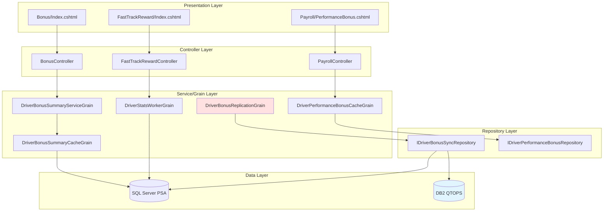
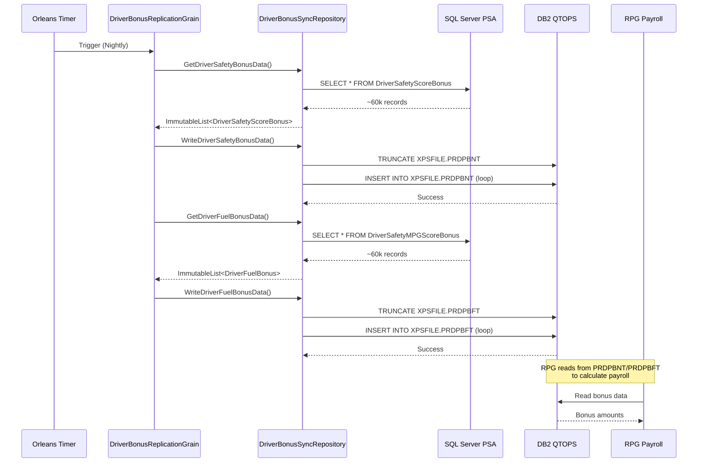
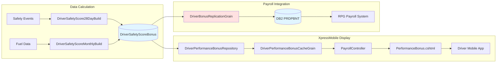
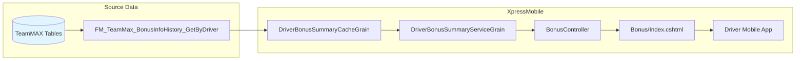
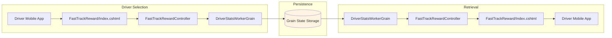

# XpressMobile Bonus System - Engineering Deep Dive

## Table of Contents
- [Architecture Overview](#architecture-overview)
- [Driver-Facing Views](#driver-facing-views)
- [Controllers](#controllers)
- [Orleans Grains](#orleans-grains)
- [Data Repositories](#data-repositories)
- [SQL Server Stored Procedures](#sql-server-stored-procedures)
- [DB2 Replication](#db2-replication)
- [Data Flow Diagrams](#data-flow-diagrams)

---

## Architecture Overview

The bonus system follows a layered architecture pattern:



---

## Driver-Facing Views

### 1. Bonus/Index.cshtml

**Location**: `c:\source\xm\EleosIntegration\XpressMobile.EleosIntegration.WebHost\Views\Bonus\Index.cshtml`

**Purpose**: Displays TeamMAX vacation and bonus summary information

**Model**: `BonusSummary` (wraps `VacationEligibility`)

**Key Fields Displayed**:
- Vacation eligibility (Yes/No)
- Vacation accrued miles vs target miles
- Vacation increments available/issued
- Bonus accrued miles vs target miles
- Bonus increments issued

**Code Structure**:
```csharp
@model XpressMobile.EleosIntegration.WebHost.Models.BonusSummary

// Displays error message if present
@if (!string.IsNullOrEmpty(Model.ErrorMessage))

// Shows eligibility return message
@Model.Eligibility.ReturnMessage

// Vacation section
@Model.Eligibility.VacationEligibleYesNo
@Model.Eligibility.Vacation.AccruedMiles
@Model.Eligibility.Vacation.TargetMiles
@Model.Eligibility.Vacation.IncrementsAvailable
@Model.Eligibility.Vacation.IncrementsIssued

// Bonus section
@Model.Eligibility.Bonus.AccruedMiles
@Model.Eligibility.Bonus.TargetMiles
@Model.Eligibility.Bonus.IncrementsIssued
```

---

### 2. FastTrackReward/Index.cshtml

**Location**: `c:\source\xm\EleosIntegration\XpressMobile.EleosIntegration.WebHost\Views\FastTrackReward\Index.cshtml`

**Purpose**: Allows drivers to select monthly reward preference (Bonus vs Vacation)

**Model**: `ActionRequest`

**Key Features**:
- Radio button selection between "Bonus pay" and "Paid Vacation"
- Lock-in date display (selection deadline)
- Form submission to save driver's choice
- JavaScript for UI interaction

**ViewBag Data**:
- `SelectedItem` - Current selection ("Bonus" or "Vacation")
- `DriverID` - Driver number
- `Company` - Company code
- `NextDate` - Lock-in date for next month

**Form Action**: `POST /FastTrackReward/SetNewSelection`

---

### 3. Payroll/PerformanceBonus.cshtml

**Location**: `c:\source\xm\EleosIntegration\XpressMobile.EleosIntegration.WebHost\Views\Payroll\PerformanceBonus.cshtml`

**Purpose**: Comprehensive performance bonus dashboard with charts and historical data

**Model**: `PerformanceBonusData`

**Key Features**:
- **Current Bonus Section** (USX OTR drivers only):
  - Donut chart showing total bonus breakdown
  - Safety, Paid Miles L1, Paid Miles L2 categories
  - Bonus month and pay date display
  
- **Historical Bonus Section** (all drivers):
  - Line chart with time range filters (3M, YTD, 1Y, 2Y, 3Y)
  - Historical bonus table with pay dates and amounts
  
- **Bottom Sheet Details**:
  - Tabbed interface: Payout, Score/Target, Bonus Per Mile
  - Detailed breakdown by category
  - Achievement indicators

**JavaScript Libraries**:
- Chart.js for data visualization
- jQuery for DOM manipulation
- Custom `performance-bonus.js` for chart rendering

---

## Controllers

### 1. BonusController

**Location**: `c:\source\xm\EleosIntegration\XpressMobile.EleosIntegration.WebHost\Controllers\BonusController.cs`

**Endpoints**:

#### GET /Bonus/Index
```csharp
[HttpGet]
[AuthenticateRequest(AuthorizationTokenType.WebToken)]
public async Task<IActionResult> Index()
```

**Flow**:
1. Authenticate request via WebToken
2. Get authenticated user from request context
3. Call `IDriverBonusSummaryServiceGrain.GetDriverBonusSummary()`
4. Return view with `BonusSummary` model

**Error Handling**:
- Returns unauthorized if authentication fails
- Returns view with error message if data retrieval fails

---

### 2. FastTrackRewardController

**Location**: `c:\source\xm\EleosIntegration\XpressMobile.EleosIntegration.WebHost\Controllers\FastTrackRewardController.cs`

**Endpoints**:

#### GET /FastTrackReward/Index
```csharp
[HttpGet]
public async Task<IActionResult> Index()
```

**Flow**:
1. Authenticate via cookie or header token
2. Get driver info from `IDriverGrain`
3. Call `IDriverStatsWorkerGrain.GetCurrentStats()` to retrieve current selection
4. Set ViewBag data for rendering
5. Return view

**Default Behavior**:
- If no selection exists, defaults to "Bonus"
- Sets unlock date to first day of next month

#### POST /FastTrackReward/SetNewSelection
```csharp
[HttpPost]
public async Task<ActionResult> SetNewSelection([FromForm] ActionRequest request)
```

**Flow**:
1. Call `IDriverStatsWorkerGrain.SetDriverRewardByUser()` to save selection
2. Update ViewBag with new selection
3. Return to Index view

---

## Orleans Grains

### 1. DriverBonusSummaryServiceGrain

**Location**: `c:\source\xm\EleosIntegration\Grains\DriverBonusSummary\DriverBonusSummaryServiceGrain.cs`

**Type**: Stateless Worker Grain

**Interface**: `IDriverBonusSummaryServiceGrain`

**Key Method**:
```csharp
public async Task<Option<VacationEligibility>> GetDriverBonusSummary(MobileDriverIdentifier driver)
```

**Responsibilities**:
- Check if `DriverBonusSummary` feature is enabled
- Delegate to `IDriverBonusSummaryCacheGrain` for actual data retrieval
- Error handling and logging

**Feature Flag**: `FeatureName.DriverBonusSummary`

---

### 2. DriverBonusSummaryCacheGrain

**Location**: `c:\source\xm\EleosIntegration\Grains\DriverBonusSummary\IDriverBonusSummaryCacheGrain.cs`

**Type**: Stateful Grain (keyed by DispatchSystem + DriverNumber)

**Key Methods**:
```csharp
Task<Option<VacationEligibility>> GetDriverBonusSummary(DriverIdentifier driver);
Task CacheDriverBonusSummary(VacationEligibility eligibility);
```

**State**: `DriverBonusSummaryState`

**Grain Key Pattern**: `(int)DispatchSystem : "{DriverNumber}"`

**Responsibilities**:
- Cache vacation/bonus eligibility data
- Retrieve cached data for display
- Persist state to Orleans storage

---

### 3. DriverPerformanceBonusCacheGrain

**Location**: `c:\source\xm\EleosIntegration\Grains\Payroll\DriverPerformanceBonusCacheGrain.cs`

**Type**: Stateful Grain

**Interface**: `IDriverPerformanceBonusCacheGrain`

**Key Methods**:
```csharp
Task CachePerformanceBonus(PerformanceBonusDetails driverSafetyScore);
Task<Option<PerformanceBonusDetails>> GetPerformanceBonus();
Task ClearPerformanceBonus();
Task<ImmutableList<PerformanceBonusDetails>> GetPerformanceBonusDetailsGetByDriverAndDateRangeDb2(
    Guid correlationId, string driverNumber, DateTime periodStart, DateTime periodEnd);
```

**State**: `PerformanceBonusCacheState`

**Dependencies**:
- `IDriverPerformanceBonusRepository` - For DB2 historical data retrieval

**Responsibilities**:
- Cache current performance bonus details
- Retrieve historical bonus data from DB2
- Clear cache when needed

---

### 4. DriverBonusReplicationGrain

**Location**: `c:\source\xm\EleosIntegration\Grains\Bonus\IDriverBonusReplicationGrain.cs`

**Type**: Worker Grain (scheduled background job)

**Interface**: `IDriverBonusReplicationGrain : IStartableGrain`

**Feature Flag**: `FeatureName.DriverBonusDataSync`

**Schedule Configuration**:
- `ReminderDueTime`: `appSettings.DriverBonusDataSyncProcessorDueTime`
- `ReminderPeriod`: `appSettings.DriverBonusDataSyncProcessorPeriod`

**Workflow**:
```csharp
protected override TryAsync<Unit> DoAsyncWork(TaskScheduler scheduler, Guid correlationId) =>
    async () => await match(
        from safety in this.GetSafetyBonusDataFromSQLServer(correlationId)
        from safetyResult in this.WriteSafetyBonusDataToDB2(correlationId, safety)
        from fuel in this.GetFuelBonusDataFromSQLServer(correlationId)
        from fuelResult in this.WriteFuelBonusDataToDB2(correlationId, fuel)
        select unit,
        Some: v => { /* Success logging */ },
        None: () => { /* No data logging */ },
        Fail: ex => { /* Error logging */ });
```

**Process Steps**:
1. Read safety bonus data from SQL Server (`PSA.dbo.DriverSafetyScoreBonus`)
2. Truncate and write to DB2 (`XPSFILE.PRDPBNT`)
3. Read fuel bonus data from SQL Server (`PSA.dbo.DriverSafetyMPGScoreBonus`)
4. Truncate and write to DB2 (`XPSFILE.PRDPBFT`)

**Error Handling**:
- Uses functional programming patterns (LanguageExt)
- Logs individual record failures without stopping entire process
- Correlation ID for tracing

---

## Data Repositories

### DriverBonusSyncRepository

**Location**: `c:\source\xm\EleosIntegration\XpressMobile.EleosIntegration.Data\Repositories\IDriverBonusSyncRepository.cs`

**Interface Methods**:

#### GetDriverSafetyBonusData
```csharp
TryOptionAsync<ImmutableList<DriverSafetyScoreBonus>> GetDriverSafetyBonusData(Guid correlationId);
```

**SQL Query**: `SELECT * FROM DriverSafetyScoreBonus WITH (NOLOCK) ORDER BY DriverNumber`

**Returns**: List of safety score bonus records

---

#### GetDriverFuelBonusData
```csharp
TryOptionAsync<ImmutableList<DriverFuelBonus>> GetDriverFuelBonusData(Guid correlationId);
```

**SQL Query**: `SELECT * FROM DriverSafetyMPGScoreBonus WITH (NOLOCK)`

**Returns**: List of fuel efficiency bonus records

---

#### WriteDriverSafetyBonusData
```csharp
TryAsync<Unit> WriteDriverSafetyBonusData(
    Guid correlationId, 
    ImmutableList<DriverSafetyScoreBonus> driverSafetyScores);
```

**Process**:
1. Truncate `XPSFILE.PRDPBNT` table
2. Insert all safety bonus records
3. Uses parameterized DB2 command with 35 parameters

**DB2 Table**: `XPSFILE.PRDPBNT`

---

#### WriteDriverFuelBonusData
```csharp
TryAsync<Unit> WriteDriverFuelBonusData(
    Guid correlationId, 
    ImmutableList<DriverFuelBonus> driverFuelBonus);
```

**Process**:
1. Truncate `XPSFILE.PRDPBFT` table
2. Insert all fuel bonus records
3. Uses parameterized DB2 command with 20 parameters

**DB2 Table**: `XPSFILE.PRDPBFT`

---

## SQL Server Stored Procedures

### 1. GetDriverSafetyScoreBonus

**Location**: `c:\source\SQLServers\SQLServers\USXSQLPSA\3_Prod\PSA\Stored Procedures\dbo.GetDriverSafetyScoreBonus.sql`

**Purpose**: Retrieve all safety score bonus data for replication to DB2

**Signature**:
```sql
CREATE PROC [dbo].[GetDriverSafetyScoreBonus]
```

**Source Table**: `PSA.dbo.DriverSafetyScoreBonus`

**Key Fields**:
- `DataYear`, `DataMonth` - Period identifiers
- `Company`, `DriverNumber` - Driver identification
- `DriverFirstName`, `DriverLastName`, `DriverJobCode`, `DriverTerminal`
- `FleetManagerFirstName`, `FleetManagerLastName`
- `FleetOwnerFirstName`, `FleetOwnerLastName`
- `TruckCompany`, `TruckNumber`, `TruckControlGroup`, `TruckSBU`
- `SleeperHours`, `OnDutyHours`, `DrivingHours`
- `EventPoints`, `SafetyScore`
- `LoadedMiles`, `EmptyMiles`, `DispatchMiles`, `PayrollMiles`
- `DispatchMPG`, `FuelUsed`
- `ValidDriverLink`, `ValidTruckLink`, `HasEventRecorder`
- `AccidentFlag`, `SafetyBonusVideoViewed`

**Notes**:
- No WHERE clause (full table replication)
- Processes ~60k records per year since 2023
- Destination table is truncated before repopulation

---

### 2. GetDriverFuelBonusData

**Location**: `c:\source\SQLServers\SQLServers\USXSQLPSA\3_Prod\PSA\Stored Procedures\dbo.GetDriverFuelBonusData.sql`

**Purpose**: Retrieve all fuel efficiency bonus data for replication to DB2

**Signature**:
```sql
CREATE PROC [dbo].[GetDriverFuelBonusData]
```

**Source Table**: `PSA.dbo.DriverSafetyMPGScoreBonus`

**Key Fields**:
- `DataYear`, `DataMonth`
- `Company`, `DriverNumber`, `ControlGroup`, `JobCode`, `EmpStatus`
- `FromDttm`, `ToDttm` - Period boundaries
- `MostRecentTruckCM`, `MostRecentTruckNbr`
- `CTPFlag`, `CabType`, `APU`, `Idle`
- `PaidMiles`, `DispatchMiles`, `Fuel`, `DispatchMPG`
- `EngineTime`, `PurchasedFuel`

**Notes**:
- Uses `WITH(NOLOCK)` for read performance
- No WHERE clause (full table replication)

---

### 3. FM_TeamMax_BonusInfoHistory_GetByDriver

**Location**: `c:\source\SQLServers\SQLServers\USXSQLPSA\3_Prod\XPM\Stored Procedures\dbo.FM_TeamMax_BonusInfoHistory_GetByDriver.sql`

**Purpose**: Retrieve TeamMAX bonus payment history for a specific driver

**Signature**:
```sql
CREATE PROC [dbo].[FM_TeamMax_BonusInfoHistory_GetByDriver]
(
   @pDriverCompany VARCHAR(4),
   @pDriverNumber  VARCHAR(9)
)
```

**Source Tables**:
- `PSA.dbo.SMFD35_XPSFILE_TEAMMAX_HISTORY_HEADER_TABLE` - Bonus history
- `PSA.dbo.SMFD35_XPSFILE_Employee_Master` - Employee data
- `PSA.dbo.SMFD35_XPSFILE_Employee_AR_Tran` - AR transactions (paychecks)

**Returns**:
- `DriverCompany`, `DriverId`
- `CheckNumber`, `CheckDate`, `CheckDescriptor`, `CheckType`
- `BonusType`

**Filters**:
- Specific driver (company + number)
- Transaction type = 'PY' (Payroll)
- Check number > 0

---

## DB2 Replication

### Replication Flow



### DB2 Tables

#### XPSFILE.PRDPBNT (Safety Bonus)

**Purpose**: Safety performance bonus data for payroll processing

**Key Fields** (35 total):
- `DPBXYEAR`, `DPBXMTH` - Period
- `DPBXCO`, `DPBXDRVID` - Driver identification
- `DPBXSS` - Safety Score
- `DPBXEP` - Event Points
- `DPBXDHRS`, `DPBXODHRS`, `DPBXSHRS` - Hours (driving, on-duty, sleeper)
- `DPBXPMILES`, `DPBXDMILES`, `DPBXLMILES`, `DPBXEMILES` - Mileage metrics
- `DPBXMPG` - Dispatch MPG
- `DPBXPAFLAG` - Accident flag
- `DPBXEVRCDR` - Has event recorder
- `DPBXSVIDEO` - Safety bonus video viewed

**Truncate/Repopulate**: Nightly via `DriverBonusReplicationGrain`

---

#### XPSFILE.PRDPBFT (Fuel Bonus)

**Purpose**: Fuel efficiency bonus data for payroll processing

**Key Fields** (20 total):
- `DPBFYEAR`, `DPBFMTH` - Period
- `DPBFCO`, `DPBFDRVID` - Driver identification
- `DPBFPMILES`, `DPBFDMILES` - Paid/Dispatch miles
- `DPBFFUEL`, `DPBFPFUEL` - Fuel used/purchased
- `DPBFMPG` - Dispatch MPG
- `DPBFCTP` - CTP Flag
- `DPBFCABTYP` - Cab type
- `DPBFABU` - APU
- `DPBFIDLE` - Idle time

**Truncate/Repopulate**: Nightly via `DriverBonusReplicationGrain`

---

## Data Flow Diagrams

### Performance Bonus Data Flow



### TeamMAX Bonus Data Flow



### Fast Track Reward Data Flow



---

## Configuration

### App Settings

**Bonus Replication**:
- `DriverBonusDataSyncProcessorDueTime` - Initial delay before first run
- `DriverBonusDataSyncProcessorPeriod` - Interval between runs (typically 24 hours)

**Feature Flags**:
- `FeatureName.DriverBonusSummary` - Enable/disable TeamMAX bonus view
- `FeatureName.PerformanceBonus` - Enable/disable performance bonus view
- `FeatureName.CacheDriverStats` - Enable/disable Fast Track rewards
- `FeatureName.DriverBonusDataSync` - Enable/disable DB2 replication

**Connection Strings**:
- `iSeriesConnectionFactory` - DB2 connection for QTOPS
- `psaConnectionFactory` - SQL Server connection for PSA database

---

## Error Handling & Logging

### Logging Patterns

**Timed Operations**:
```csharp
using (this.logger.BeginTimedOperation(
    "Elapsed",
    "OperationName",
    LogEventLevel.Information,
    new TimeSpan(0, 0, 13),  // Warning threshold
    LogEventLevel.Warning,
    "Begin {TimedOperationId}",
    "End {TimedOperationId}:{TimedOperationDescription}...",
    "Exceeded {TimedOperationId}..."))
{
    // Operation code
}
```

**Correlation IDs**:
- Every request/operation has a unique `Guid correlationId`
- Logged with all operations for tracing
- Enables end-to-end request tracking

**Structured Logging**:
- Uses Serilog with structured data
- Logs objects as `{@Object}` for full serialization
- Includes driver identifiers, record counts, timing metrics

### Error Recovery

**Repository Level**:
- Individual record failures logged but don't stop batch processing
- Try-catch around each DB2 insert operation
- Correlation ID included in error logs

**Grain Level**:
- Functional programming patterns (TryAsync, TryOptionAsync)
- Match expressions for success/failure handling
- Graceful degradation (return None instead of throwing)

**Controller Level**:
- Authentication failures return Unauthorized
- Data retrieval failures return view with error message
- Exception logging with full context

---

## Performance Considerations

### Caching Strategy

**Orleans Grain State**:
- Bonus data cached in grain state for fast retrieval
- Reduces database load for frequently accessed data
- Automatic persistence to Orleans storage

**Database Queries**:
- Uses `WITH (NOLOCK)` for read operations
- Minimizes locking contention
- Acceptable for bonus data (not transactional)

### Replication Optimization

**Batch Processing**:
- Reads all records in single query
- Writes to DB2 in loop (individual inserts)
- Truncate before insert ensures clean state

**Timing**:
- Runs nightly during off-peak hours
- Processes ~60k records per table
- Typical completion time: < 20 seconds per table

---

## Security

### Authentication

**Token-Based**:
- All bonus views require `[AuthenticateRequest(AuthorizationTokenType.WebToken)]`
- Token validated against `IAuthenticationService`
- Driver identity extracted from validated token

**Authorization**:
- Data filtered by authenticated driver identity
- No cross-driver data access
- Company-specific feature restrictions

### Data Protection

**SQL Injection Prevention**:
- Parameterized queries throughout
- No dynamic SQL construction
- Repository pattern enforces safe data access

**Connection Security**:
- Encrypted connections to SQL Server and DB2
- Connection strings stored in secure configuration
- No credentials in code

---

## Testing Considerations

### Unit Testing

**Grain Testing**:
- Mock `IDriverBonusSyncRepository` for isolation
- Test functional programming patterns (TryAsync)
- Verify error handling paths

**Controller Testing**:
- Mock grain factory and helper services
- Test authentication failures
- Verify view model construction

### Integration Testing

**Database Operations**:
- Test stored procedure execution
- Verify data mapping from DataReader
- Test DB2 insert operations

**End-to-End**:
- Test complete flow from view to database
- Verify replication process
- Test with production-like data volumes

---

## Troubleshooting Guide

### Common Issues

**Bonus Data Not Displaying**:
1. Check feature flag: `FeatureName.DriverBonusSummary`
2. Verify driver is in eligible company (01, 63 for TeamMAX)
3. Check grain state for cached data
4. Verify SQL Server connectivity

**Replication Failures**:
1. Check SEQ logs for correlation ID
2. Verify DB2 connection string
3. Check table permissions (XPSFILE.PRDPBNT, PRDPBFT)
4. Verify stored procedures exist and execute

**Performance Issues**:
1. Check timed operation logs for slow queries
2. Verify Orleans cluster health
3. Check database server load
4. Review grain activation counts

### Diagnostic Queries

**Check Bonus Data in SQL**:
```sql
SELECT TOP 100 * 
FROM PSA.dbo.DriverSafetyScoreBonus 
WHERE DriverNumber = '12345'
ORDER BY DataYear DESC, DataMonth DESC
```

**Check DB2 Replication**:
```sql
SELECT COUNT(*) FROM XPSFILE.PRDPBNT
SELECT COUNT(*) FROM XPSFILE.PRDPBFT
```

**Check Grain State** (via Orleans Dashboard or logs):
- Search for grain activation logs
- Check state persistence logs
- Verify reminder execution logs

---

## Future Enhancements

### Potential Improvements

1. **Real-time Updates**: Move from nightly batch to near-real-time replication
2. **Caching Strategy**: Implement Redis for distributed caching
3. **API Endpoints**: Expose bonus data via REST API for mobile app
4. **Historical Trends**: Add more sophisticated analytics and trending
5. **Notifications**: Alert drivers when bonus thresholds are reached
6. **Performance**: Optimize DB2 writes with bulk insert operations

### Technical Debt

1. **Stored Procedures**: Some use `SELECT *` which could break with schema changes
2. **Error Handling**: Individual insert failures could be batched for retry
3. **Monitoring**: Add application insights for better observability
4. **Testing**: Increase unit test coverage for edge cases
