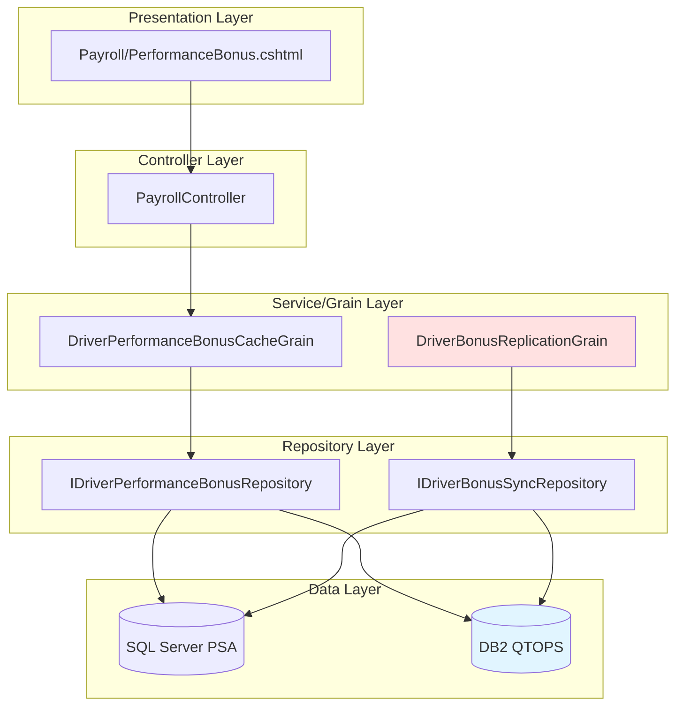
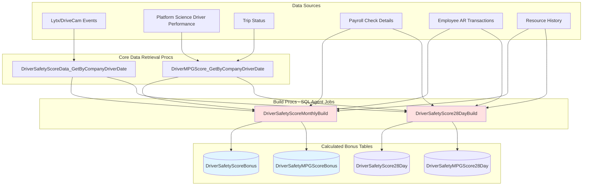
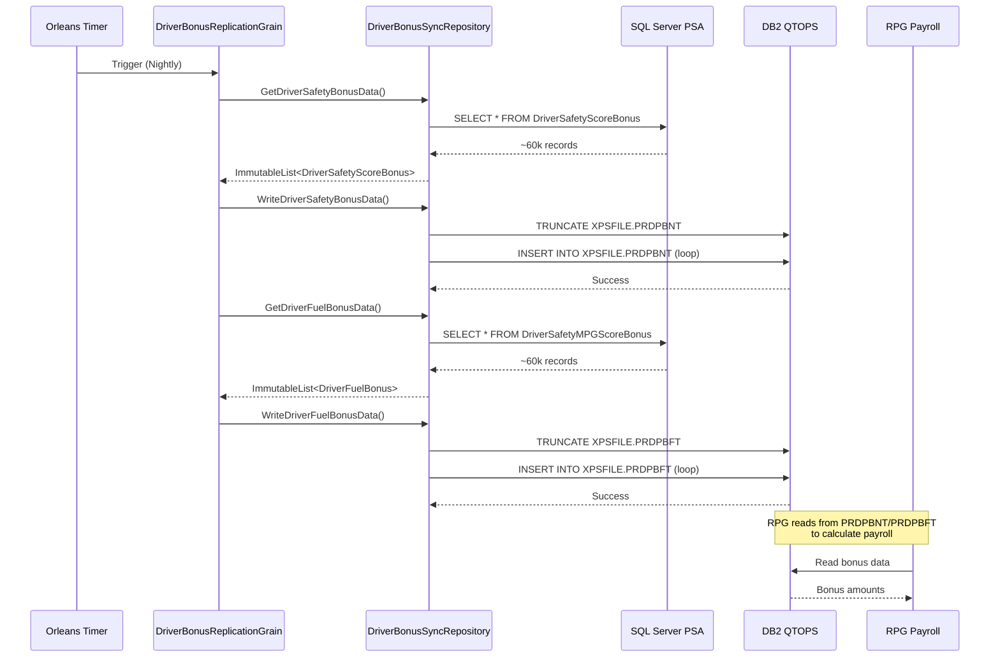
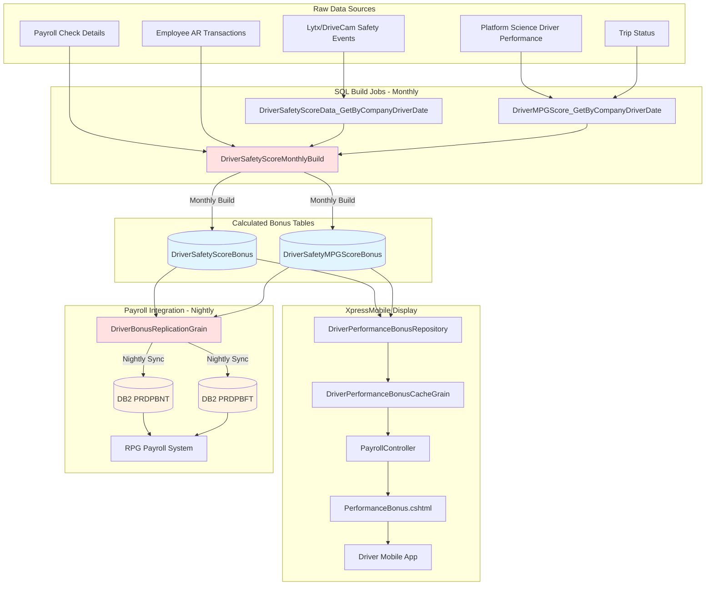

# XpressMobile Bonus System - Engineering Deep Dive

## Table of Contents
- [Architecture Overview](#architecture-overview)
- [Driver-Facing Views](#driver-facing-views)
- [Controllers](#controllers)
- [Orleans Grains](#orleans-grains)
- [Data Repositories](#data-repositories)
- [SQL Server Stored Procedures](#sql-server-stored-procedures)
- [DB2 Replication](#db2-replication)
- [Data Flow Diagrams](#data-flow-diagrams)

---

## Architecture Overview

The bonus system follows a layered architecture pattern:



---

## Driver-Facing View

### Payroll/PerformanceBonus.cshtml

**Location**: `c:\source\xm\EleosIntegration\XpressMobile.EleosIntegration.WebHost\Views\Payroll\PerformanceBonus.cshtml`

**Purpose**: Comprehensive performance bonus dashboard with charts and historical data

**Model**: `PerformanceBonusData`

**Key Features**:
- **Current Bonus Section** (USX OTR drivers only):
  - Donut chart showing total bonus breakdown
  - Safety, Paid Miles L1, Paid Miles L2 categories
  - Bonus month and pay date display
  
- **Historical Bonus Section** (all drivers):
  - Line chart with time range filters (3M, YTD, 1Y, 2Y, 3Y)
  - Historical bonus table with pay dates and amounts
  
- **Bottom Sheet Details**:
  - Tabbed interface: Payout, Score/Target, Bonus Per Mile
  - Detailed breakdown by category
  - Achievement indicators

**JavaScript Libraries**:
- Chart.js for data visualization
- jQuery for DOM manipulation
- Custom `performance-bonus.js` for chart rendering

---

## Controllers

### PayrollController

**Location**: `c:\source\xm\EleosIntegration\XpressMobile.EleosIntegration.WebHost\Controllers\PayrollController.cs`

**Endpoints**:

#### GET /Payroll/PerformanceBonus/{company}/{driverId}
```csharp
[HttpGet]
[AuthenticateRequest(AuthorizationTokenType.WebToken)]
public async Task<IActionResult> PerformanceBonus(string company, string driverId)
```

**Flow**:
1. Authenticate request via WebToken
2. Get authenticated user from request context
3. Call `IDriverPerformanceBonusCacheGrain.GetPerformanceBonus()` for current bonus
4. Call `IDriverPerformanceBonusCacheGrain.GetPerformanceBonusDetailsGetByDriverAndDateRangeDb2()` for historical data
5. Return view with `PerformanceBonusData` model

**Error Handling**:
- Returns unauthorized if authentication fails
- Returns view with error message if data retrieval fails
- Feature flag check for `PerformanceBonus`

---

## Orleans Grains

### 1. DriverPerformanceBonusCacheGrain

**Location**: `c:\source\xm\EleosIntegration\Grains\Payroll\DriverPerformanceBonusCacheGrain.cs`

**Type**: Stateful Grain

**Interface**: `IDriverPerformanceBonusCacheGrain`

**Key Methods**:
```csharp
Task CachePerformanceBonus(PerformanceBonusDetails driverSafetyScore);
Task<Option<PerformanceBonusDetails>> GetPerformanceBonus();
Task ClearPerformanceBonus();
Task<ImmutableList<PerformanceBonusDetails>> GetPerformanceBonusDetailsGetByDriverAndDateRangeDb2(
    Guid correlationId, string driverNumber, DateTime periodStart, DateTime periodEnd);
```

**State**: `PerformanceBonusCacheState`

**Dependencies**:
- `IDriverPerformanceBonusRepository` - For DB2 historical data retrieval

**Responsibilities**:
- Cache current performance bonus details
- Retrieve historical bonus data from DB2
- Clear cache when needed

---

### 2. DriverBonusReplicationGrain

**Location**: `c:\source\xm\EleosIntegration\Grains\Bonus\IDriverBonusReplicationGrain.cs`

**Type**: Worker Grain (scheduled background job)

**Interface**: `IDriverBonusReplicationGrain : IStartableGrain`

**Feature Flag**: `FeatureName.DriverBonusDataSync`

**Schedule Configuration**:
- `ReminderDueTime`: `appSettings.DriverBonusDataSyncProcessorDueTime`
- `ReminderPeriod`: `appSettings.DriverBonusDataSyncProcessorPeriod`

**Workflow**:
```csharp
protected override TryAsync<Unit> DoAsyncWork(TaskScheduler scheduler, Guid correlationId) =>
    async () => await match(
        from safety in this.GetSafetyBonusDataFromSQLServer(correlationId)
        from safetyResult in this.WriteSafetyBonusDataToDB2(correlationId, safety)
        from fuel in this.GetFuelBonusDataFromSQLServer(correlationId)
        from fuelResult in this.WriteFuelBonusDataToDB2(correlationId, fuel)
        select unit,
        Some: v => { /* Success logging */ },
        None: () => { /* No data logging */ },
        Fail: ex => { /* Error logging */ });
```

**Process Steps**:
1. Read safety bonus data from SQL Server (`PSA.dbo.DriverSafetyScoreBonus`)
2. Truncate and write to DB2 (`XPSFILE.PRDPBNT`)
3. Read fuel bonus data from SQL Server (`PSA.dbo.DriverSafetyMPGScoreBonus`)
4. Truncate and write to DB2 (`XPSFILE.PRDPBFT`)

**Error Handling**:
- Uses functional programming patterns (LanguageExt)
- Logs individual record failures without stopping entire process
- Correlation ID for tracing

---

## Data Repositories

### DriverBonusSyncRepository

**Location**: `c:\source\xm\EleosIntegration\XpressMobile.EleosIntegration.Data\Repositories\IDriverBonusSyncRepository.cs`

**Interface Methods**:

#### GetDriverSafetyBonusData
```csharp
TryOptionAsync<ImmutableList<DriverSafetyScoreBonus>> GetDriverSafetyBonusData(Guid correlationId);
```

**SQL Query**: `SELECT * FROM DriverSafetyScoreBonus WITH (NOLOCK) ORDER BY DriverNumber`

**Returns**: List of safety score bonus records

---

#### GetDriverFuelBonusData
```csharp
TryOptionAsync<ImmutableList<DriverFuelBonus>> GetDriverFuelBonusData(Guid correlationId);
```

**SQL Query**: `SELECT * FROM DriverSafetyMPGScoreBonus WITH (NOLOCK)`

**Returns**: List of fuel efficiency bonus records

---

#### WriteDriverSafetyBonusData
```csharp
TryAsync<Unit> WriteDriverSafetyBonusData(
    Guid correlationId, 
    ImmutableList<DriverSafetyScoreBonus> driverSafetyScores);
```

**Process**:
1. Truncate `XPSFILE.PRDPBNT` table
2. Insert all safety bonus records
3. Uses parameterized DB2 command with 35 parameters

**DB2 Table**: `XPSFILE.PRDPBNT`

---

#### WriteDriverFuelBonusData
```csharp
TryAsync<Unit> WriteDriverFuelBonusData(
    Guid correlationId, 
    ImmutableList<DriverFuelBonus> driverFuelBonus);
```

**Process**:
1. Truncate `XPSFILE.PRDPBFT` table
2. Insert all fuel bonus records
3. Uses parameterized DB2 command with 20 parameters

**DB2 Table**: `XPSFILE.PRDPBFT`

---

## SQL Server Stored Procedures

### 1. GetDriverSafetyScoreBonus

**Location**: `c:\source\SQLServers\SQLServers\USXSQLPSA\3_Prod\PSA\Stored Procedures\dbo.GetDriverSafetyScoreBonus.sql`

**Purpose**: Retrieve all safety score bonus data for replication to DB2

**Signature**:
```sql
CREATE PROC [dbo].[GetDriverSafetyScoreBonus]
```

**Source Table**: `PSA.dbo.DriverSafetyScoreBonus`

**Key Fields**:
- `DataYear`, `DataMonth` - Period identifiers
- `Company`, `DriverNumber` - Driver identification
- `DriverFirstName`, `DriverLastName`, `DriverJobCode`, `DriverTerminal`
- `FleetManagerFirstName`, `FleetManagerLastName`
- `FleetOwnerFirstName`, `FleetOwnerLastName`
- `TruckCompany`, `TruckNumber`, `TruckControlGroup`, `TruckSBU`
- `SleeperHours`, `OnDutyHours`, `DrivingHours`
- `EventPoints`, `SafetyScore`
- `LoadedMiles`, `EmptyMiles`, `DispatchMiles`, `PayrollMiles`
- `DispatchMPG`, `FuelUsed`
- `ValidDriverLink`, `ValidTruckLink`, `HasEventRecorder`
- `AccidentFlag`, `SafetyBonusVideoViewed`

**Notes**:
- No WHERE clause (full table replication)
- Replicates ~60k total records accumulated per year since 2023
- Destination table is truncated before repopulation

---

### 2. GetDriverFuelBonusData

**Location**: `c:\source\SQLServers\SQLServers\USXSQLPSA\3_Prod\PSA\Stored Procedures\dbo.GetDriverFuelBonusData.sql`

**Purpose**: Retrieve all fuel efficiency bonus data for replication to DB2

**Signature**:
```sql
CREATE PROC [dbo].[GetDriverFuelBonusData]
```

**Source Table**: `PSA.dbo.DriverSafetyMPGScoreBonus`

**Key Fields**:
- `DataYear`, `DataMonth`
- `Company`, `DriverNumber`, `ControlGroup`, `JobCode`, `EmpStatus`
- `FromDttm`, `ToDttm` - Period boundaries
- `MostRecentTruckCM`, `MostRecentTruckNbr`
- `CTPFlag`, `CabType`, `APU`, `Idle`
- `PaidMiles`, `DispatchMiles`, `Fuel`, `DispatchMPG`
- `EngineTime`, `PurchasedFuel`

**Notes**:
- Uses `WITH(NOLOCK)` for read performance
- No WHERE clause (full table replication)

---

## Bonus Data Calculation (SQL Jobs)

### Overview

Before bonus data can be replicated to DB2 or displayed to drivers, it must first be calculated and populated into the SQL Server tables. This is done by scheduled SQL Server Agent jobs that run stored procedures to build the bonus data.

### 1. DriverSafetyScoreMonthlyBuild

**Location**: `c:\source\SQLServers\SQLServers\USXSQLPSA\3_Prod\PSA\Stored Procedures\dbo.DriverSafetyScoreMonthlyBuild.sql`

**Purpose**: Generate monthly driver safety and fuel bonus data for payroll

**Schedule**: Runs 7 days after end of month (to allow all payroll data to settle)

**Parameters**:
- `@pBegDate` - Beginning date (defaults to first day of previous month)
- `@pCompanyList` - Comma-separated company codes (defaults to '01')

**Process Flow**:
1. **Validate**: Check that data doesn't already exist for the period
2. **Get Safety Data**: Call `DriverSafetyScoreData_GetByCompanyDriverDate` to retrieve:
   - Event points from Lytx/DriveCam safety events
   - Driving hours, on-duty hours, sleeper hours
   - Safety score calculation: `(EventPoints / DrivingHours) * 500`
3. **Get Mileage Data**:
   - Loaded miles, empty miles, dispatch miles from Trip Status
   - Payroll miles from check details and AR transactions
   - Minimum pay miles for team drivers
4. **Get Truck Assignment**: Most recent truck from Resource History
5. **Validate Lytx Links**:
   - Check if driver has valid Lytx/DriveCam link
   - Check if truck has valid Lytx/DriveCam link
   - Check if truck has event recorder (camera)
6. **Get Accident Flag**: Check for safety events in period
7. **Get Safety Video Status**: Check if driver completed safety bonus video
8. **Get Fuel Data**: Call `DriverMPGScore_GetByCompanyDriverDate` to retrieve:
   - Fuel used, purchased fuel, dispatch MPG
   - Paid miles, dispatch miles
   - Truck details (CTP flag, cab type, APU, idle time)
9. **Insert Data**:
   - Insert into `PSA.dbo.DriverSafetyScoreBonus` (safety bonus data)
   - Insert into `PSA.dbo.DriverSafetyMPGScoreBonus` (fuel bonus data)

**Target Tables**:
- `PSA.dbo.DriverSafetyScoreBonus` - Monthly safety performance data
- `PSA.dbo.DriverSafetyMPGScoreBonus` - Monthly fuel efficiency data

**Key Business Rules**:
- Prevents duplicate runs (throws error if data exists for period)
- Processes ~7k active driver records per month (~60k total records accumulated per year since 2023)
- Calculates safety score based on event points per driving hour
- Prorates fuel data by driver control group changes

---

### 2. DriverSafetyScore28DayBuild

**Location**: `c:\source\SQLServers\SQLServers\USXSQLPSA\3_Prod\PSA\Stored Procedures\dbo.DriverSafetyScore28DayBuild.sql`

**Purpose**: Generate 28-day rolling driver safety snapshots for trending analysis

**Schedule**: Runs weekly on Saturday for the previous Friday snapshot

**Parameters**:
- `@pEndDate` - End date (defaults to most recent Friday)
- `@pCompanyList` - Comma-separated company codes (defaults to '01')

**Process Flow**:
1. **Calculate Date Range**: 28-day period ending on Friday
2. **Validate**: Check that data doesn't already exist for the period
3. **Get Safety Data**: Call `DriverSafetyScoreData_GetByCompanyDriverDate`
4. **Calculate Safety Score**: Same formula as monthly build
5. **Get Mileage and Truck Data**: Similar to monthly build
6. **Validate Lytx Links**: Same as monthly build
7. **Get Payroll Miles**: From check details and AR transactions
8. **Get Fuel Data**: Call `DriverMPGScore_GetByCompanyDriverDate`
9. **Purge Old Data**: Delete snapshots older than 26 weeks (6 months retention)
10. **Insert Data**:
    - Insert into `PSA.dbo.DriverSafetyScore28Day`
    - Insert into `PSA.dbo.DriverSafetyMPGScore28Day`

**Target Tables**:
- `PSA.dbo.DriverSafetyScore28Day` - 28-day safety snapshots
- `PSA.dbo.DriverSafetyMPGScore28Day` - 28-day fuel snapshots

**Key Business Rules**:
- Maintains 26 weeks (6 months) of rolling snapshots
- Used for trending and historical analysis
- Runs weekly to provide consistent snapshots

---

### 3. DriverSafetyScoreData_GetByCompanyDriverDate

**Location**: `c:\source\SQLServers\SQLServers\USXSQLPSA\3_Prod\PSA\Stored Procedures\dbo.DriverSafetyScoreData_GetByCompanyDriverDate.sql`

**Purpose**: Core data retrieval for driver safety calculations

**Called By**: 
- `DriverSafetyScoreMonthlyBuild`
- `DriverSafetyScore28DayBuild`

**Parameters**:
- `@pCompanyList` - List of companies to process
- `@pDriverList` - Optional list of specific drivers
- `@pBegDate` - Beginning date
- `@pEndDate` - End date

**Data Sources**:
- **Lytx/DriveCam Events**: Safety events with coaching status
- **Driver Terminal Time Zones**: For accurate daily boundaries
- **Event Points**: Calculated based on event severity and coaching status

**Returns**:
- Event points per driver per day
- Driving hours, on-duty hours, sleeper hours
- Driver and terminal information

**Key Business Rules**:
- Only includes "coachable events" (events that went through face-to-face coaching)
- Respects driver terminal time zones for daily boundaries
- Aggregates event points based on severity

---

### 4. DriverMPGScore_GetByCompanyDriverDate

**Location**: `c:\source\SQLServers\SQLServers\USXSQLPSA\3_Prod\PSA\Stored Procedures\dbo.DriverMPGScore_GetByCompanyDriverDate.sql`

**Purpose**: Core data retrieval for driver fuel efficiency calculations

**Called By**:
- `DriverSafetyScoreMonthlyBuild`
- `DriverSafetyScore28DayBuild`

**Parameters**:
- `@pCompanyList` - List of companies to process
- `@pDriverList` - Optional list of specific drivers
- `@pBegDate` - Beginning date
- `@pEndDate` - End date

**Data Sources**:
- **Platform Science Driver Performance**: Daily fuel, idle, engine time data
- **Trip Status**: Dispatch miles for MPG calculation
- **Driver Control Group History**: For prorating fuel across DCG changes
- **CTP Truck List**: Identifies trucks with unreliable Platform Science data

**Returns**:
- Fuel used, purchased fuel
- Paid miles, dispatch miles
- Dispatch MPG calculation
- Truck details (CTP flag, cab type, APU, idle time, engine time)
- Control group and employment status

**Key Business Rules**:
- Prorates fuel data when driver changes control groups mid-period
- Excludes CTP trucks (unreliable Platform Science data)
- Uses purchased fuel (not consumed fuel) for MPG calculation
- Handles UTC date boundaries from Platform Science data

---

### Bonus Calculation Architecture



---

## DB2 Replication

### Replication Flow



### DB2 Tables

#### XPSFILE.PRDPBNT (Safety Bonus)

**Purpose**: Safety performance bonus data for payroll processing

**Key Fields** (35 total):
- `DPBXYEAR`, `DPBXMTH` - Period
- `DPBXCO`, `DPBXDRVID` - Driver identification
- `DPBXSS` - Safety Score
- `DPBXEP` - Event Points
- `DPBXDHRS`, `DPBXODHRS`, `DPBXSHRS` - Hours (driving, on-duty, sleeper)
- `DPBXPMILES`, `DPBXDMILES`, `DPBXLMILES`, `DPBXEMILES` - Mileage metrics
- `DPBXMPG` - Dispatch MPG
- `DPBXPAFLAG` - Accident flag
- `DPBXEVRCDR` - Has event recorder
- `DPBXSVIDEO` - Safety bonus video viewed

**Truncate/Repopulate**: Nightly via `DriverBonusReplicationGrain`

---

#### XPSFILE.PRDPBFT (Fuel Bonus)

**Purpose**: Fuel efficiency bonus data for payroll processing

**Key Fields** (20 total):
- `DPBFYEAR`, `DPBFMTH` - Period
- `DPBFCO`, `DPBFDRVID` - Driver identification
- `DPBFPMILES`, `DPBFDMILES` - Paid/Dispatch miles
- `DPBFFUEL`, `DPBFPFUEL` - Fuel used/purchased
- `DPBFMPG` - Dispatch MPG
- `DPBFCTP` - CTP Flag
- `DPBFCABTYP` - Cab type
- `DPBFABU` - APU
- `DPBFIDLE` - Idle time

**Truncate/Repopulate**: Nightly via `DriverBonusReplicationGrain`

---

## Data Flow Diagrams

### Performance Bonus Data Flow (Complete)




---

## Configuration

### App Settings

**Bonus Replication**:
- `DriverBonusDataSyncProcessorDueTime` - Initial delay before first run
- `DriverBonusDataSyncProcessorPeriod` - Interval between runs (typically 24 hours)

**Feature Flags**:
- `FeatureName.PerformanceBonus` - Enable/disable performance bonus view
- `FeatureName.DriverBonusDataSync` - Enable/disable DB2 replication

**Connection Strings**:
- `iSeriesConnectionFactory` - DB2 connection for QTOPS
- `psaConnectionFactory` - SQL Server connection for PSA database

---

## Error Handling & Logging

### Logging Patterns

**Timed Operations**:
```csharp
using (this.logger.BeginTimedOperation(
    "Elapsed",
    "OperationName",
    LogEventLevel.Information,
    new TimeSpan(0, 0, 13),  // Warning threshold
    LogEventLevel.Warning,
    "Begin {TimedOperationId}",
    "End {TimedOperationId}:{TimedOperationDescription}...",
    "Exceeded {TimedOperationId}..."))
{
    // Operation code
}
```

**Correlation IDs**:
- Every request/operation has a unique `Guid correlationId`
- Logged with all operations for tracing
- Enables end-to-end request tracking

**Structured Logging**:
- Uses Serilog with structured data
- Logs objects as `{@Object}` for full serialization
- Includes driver identifiers, record counts, timing metrics

### Error Recovery

**Repository Level**:
- Individual record failures logged but don't stop batch processing
- Try-catch around each DB2 insert operation
- Correlation ID included in error logs

**Grain Level**:
- Functional programming patterns (TryAsync, TryOptionAsync)
- Match expressions for success/failure handling
- Graceful degradation (return None instead of throwing)

**Controller Level**:
- Authentication failures return Unauthorized
- Data retrieval failures return view with error message
- Exception logging with full context

---

## Performance Considerations

### Caching Strategy

**Orleans Grain State**:
- Bonus data cached in grain state for fast retrieval
- Reduces database load for frequently accessed data
- Automatic persistence to Orleans storage

**Database Queries**:
- Uses `WITH (NOLOCK)` for read operations
- Minimizes locking contention
- Acceptable for bonus data (not transactional)

### Replication Optimization

**Batch Processing**:
- Reads all records in single query
- Writes to DB2 in loop (individual inserts)
- Truncate before insert ensures clean state

**Timing**:
- Runs nightly during off-peak hours
- Processes ~60k records per table
- Typical completion time: < 20 seconds per table

---

## Security

### Authentication

**Token-Based**:
- All bonus views require `[AuthenticateRequest(AuthorizationTokenType.WebToken)]`
- Token validated against `IAuthenticationService`
- Driver identity extracted from validated token

**Authorization**:
- Data filtered by authenticated driver identity
- No cross-driver data access
- Company-specific feature restrictions

### Data Protection

**SQL Injection Prevention**:
- Parameterized queries throughout
- No dynamic SQL construction
- Repository pattern enforces safe data access

**Connection Security**:
- Encrypted connections to SQL Server and DB2
- Connection strings stored in secure configuration
- No credentials in code

---

## Testing Considerations

### Unit Testing

**Grain Testing**:
- Mock `IDriverBonusSyncRepository` for isolation
- Test functional programming patterns (TryAsync)
- Verify error handling paths

**Controller Testing**:
- Mock grain factory and helper services
- Test authentication failures
- Verify view model construction

### Integration Testing

**Database Operations**:
- Test stored procedure execution
- Verify data mapping from DataReader
- Test DB2 insert operations

**End-to-End**:
- Test complete flow from view to database
- Verify replication process
- Test with production-like data volumes

---

## Troubleshooting Guide

### Common Issues

**Bonus Data Not Displaying**:
1. Check feature flag: `FeatureName.PerformanceBonus`
2. Verify driver is eligible (USX OTR drivers for current bonus)
3. Check grain state for cached data
4. Verify SQL Server connectivity
5. Verify DB2 connectivity for historical data

**Replication Failures**:
1. Check SEQ logs for correlation ID
2. Verify DB2 connection string
3. Check table permissions (XPSFILE.PRDPBNT, PRDPBFT)
4. Verify stored procedures exist and execute

**Performance Issues**:
1. Check timed operation logs for slow queries
2. Verify Orleans cluster health
3. Check database server load
4. Review grain activation counts

### Diagnostic Queries

**Check Bonus Data in SQL**:
```sql
SELECT TOP 100 * 
FROM PSA.dbo.DriverSafetyScoreBonus 
WHERE DriverNumber = '12345'
ORDER BY DataYear DESC, DataMonth DESC
```

**Check DB2 Replication**:
```sql
SELECT COUNT(*) FROM XPSFILE.PRDPBNT
SELECT COUNT(*) FROM XPSFILE.PRDPBFT
```

**Check Grain State** (via Orleans Dashboard or logs):
- Search for grain activation logs
- Check state persistence logs
- Verify reminder execution logs

---

## Future Enhancements

### Potential Improvements

1. **Real-time Updates**: Move from nightly batch to near-real-time replication
2. **Caching Strategy**: Implement Redis for distributed caching
3. **API Endpoints**: Expose bonus data via REST API for mobile app
4. **Historical Trends**: Add more sophisticated analytics and trending
5. **Notifications**: Alert drivers when bonus thresholds are reached
6. **Performance**: Optimize DB2 writes with bulk insert operations

### Technical Debt

1. **Stored Procedures**: Some use `SELECT *` which could break with schema changes
2. **Error Handling**: Individual insert failures could be batched for retry
3. **Monitoring**: Add application insights for better observability
4. **Testing**: Increase unit test coverage for edge cases
