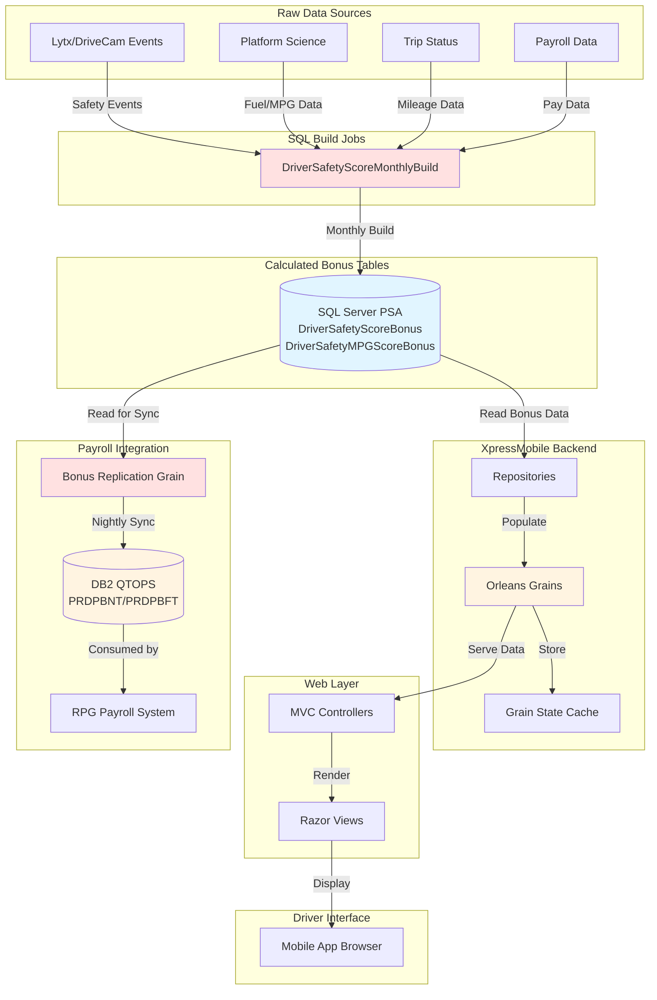

# XpressMobile Bonus System - Executive Summary

## Overview

The XpressMobile bonus system provides drivers with visibility into their performance-based compensation (safety and fuel efficiency bonuses). The system integrates data from SQL Server (PSA database), caches it in Orleans grains, displays it to drivers via web views, and replicates bonus data to DB2 (QTOPS) for payroll processing by legacy RPG systems.

## Business Purpose

Drivers can view their **Performance Bonus** information based on:
- **Safety Score** - Event points, driving hours, and safety incidents
- **Fuel Efficiency (MPG)** - Dispatch MPG and fuel consumption metrics
- **Paid Miles** - Tiered mileage-based bonuses (Level 1 & 2)

## System Architecture

## Key Components

### 1. Driver-Facing View

| View | Purpose | URL Pattern |
|------|---------|-------------|
| **Payroll/PerformanceBonus** | Detailed performance bonus breakdown with charts | `/Payroll/PerformanceBonus/{company}/{driverId}` |

### 2. Data Flow

1. **Raw Data Collection**: Safety events (Lytx), fuel data (Platform Science), mileage (Trip Status), payroll data
2. **Bonus Calculation**: SQL Server Agent jobs run monthly to calculate safety and fuel bonuses
3. **Data Storage**: Calculated bonus data stored in `DriverSafetyScoreBonus` and `DriverSafetyMPGScoreBonus` tables
4. **Caching**: Orleans grains cache bonus data for fast retrieval
5. **Display**: MVC controllers fetch from grains and render views to drivers
6. **Replication**: Nightly job syncs bonus data to DB2 for payroll processing

### 3. Bonus Calculation (SQL Jobs)

**Monthly Build Job** (`DriverSafetyScoreMonthlyBuild`):
- Runs 7 days after end of month
- Calculates safety scores from Lytx/DriveCam events
- Calculates fuel efficiency (MPG) from Platform Science data
- Aggregates mileage from Trip Status
- Includes payroll miles from check details and AR transactions
- Populates `DriverSafetyScoreBonus` and `DriverSafetyMPGScoreBonus` tables
- Processes ~60k driver records per month

**Weekly Snapshot Job** (`DriverSafetyScore28DayBuild`):
- Runs weekly on Saturday
- Creates 28-day rolling snapshots for trending
- Maintains 6 months of historical snapshots

### 4. Payroll Integration

The `DriverBonusReplicationGrain` runs nightly to:
- Read safety and fuel bonus data from SQL Server
- Truncate and repopulate DB2 tables (XPSFILE.PRDPBNT and XPSFILE.PRDPBFT)
- Enable RPG payroll systems to process driver bonuses

## Data Tables

### SQL Server (PSA)
- `PSA.dbo.DriverSafetyScoreBonus` - Safety performance bonus data
- `PSA.dbo.DriverSafetyMPGScoreBonus` - Fuel efficiency bonus data

### DB2 (QTOPS)
- `XPSFILE.PRDPBNT` - Safety bonus data for payroll
- `XPSFILE.PRDPBFT` - Fuel bonus data for payroll

## Key Features

### Performance Bonus Display
- **Safety Score** - Based on event points, driving hours, safety incidents
- **Paid Miles Level 1 & 2** - Tiered mileage-based bonuses
- **Fuel Efficiency** - MPG-based bonus calculations
- **Historical View** - 3-month to 3-year performance history
- **Visual Charts** - Donut charts and line graphs for trend analysis
- **Detailed Breakdown** - Category-specific payout, score/target, and bonus per mile data

## Technical Stack

- **Backend**: ASP.NET Core MVC, Orleans (distributed actor framework)
- **Data Access**: ADO.NET with SQL Server and DB2 connections
- **Frontend**: Razor views, Bootstrap, Chart.js
- **Authentication**: Token-based authentication via WebToken
- **Caching**: Orleans grain persistence with state management

## Security & Access Control

- All bonus views require authentication via `[AuthenticateRequest(AuthorizationTokenType.WebToken)]`
- Driver-specific data filtered by authenticated driver identity
- No cross-driver data access permitted

## Monitoring & Logging

- Timed operations logged for performance tracking
- Correlation IDs for request tracing
- Error logging with structured data (Serilog)
- Feature flags control bonus feature availability

## Business Rules

1. **Performance Bonus Display**: Only shown to USX OTR drivers; Dedicated/Total drivers see historical data only
2. **Data Caching**: Performance bonus data cached in Orleans grains for fast retrieval
3. **Replication**: Runs nightly to ensure payroll has current bonus data in DB2
4. **Historical Data**: Retrieved from DB2 tables for trend analysis

## Dependencies

- **Feature Flags**: `PerformanceBonus`, `DriverBonusDataSync`
- **External Systems**: SQL Server PSA, DB2 QTOPS, RPG Payroll
- **Orleans Cluster**: Requires healthy grain cluster for caching
- **Repositories**: `IDriverPerformanceBonusRepository`, `IDriverBonusSyncRepository`
