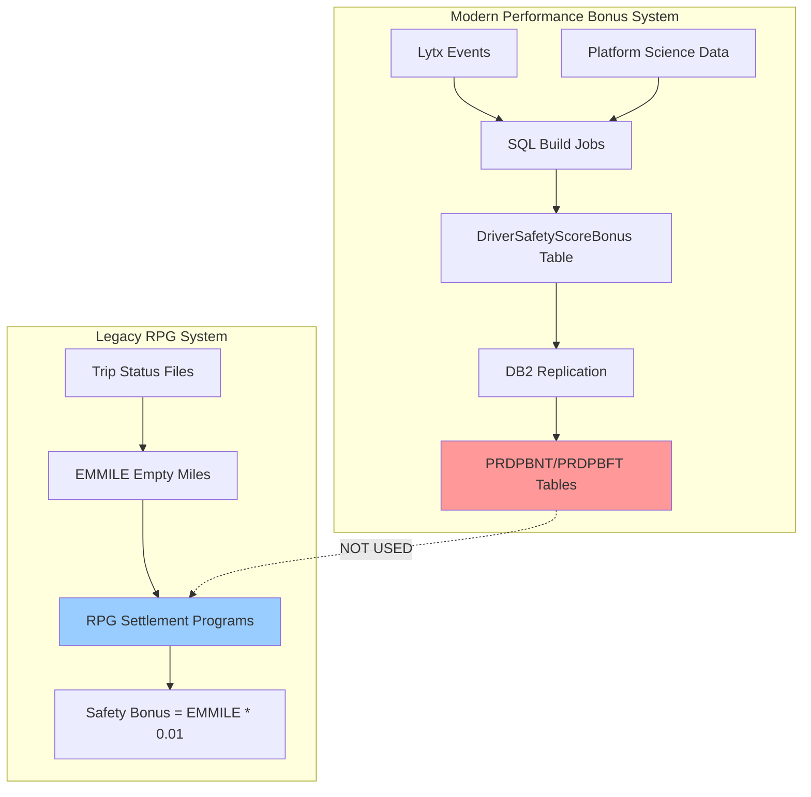

# RPG Payroll System - Bonus Integration Analysis

## Executive Summary

The RPG payroll system **does not directly consume** the performance bonus data replicated to DB2 tables (`XPSFILE.PRDPBNT` and `XPSFILE.PRDPBFT`). Instead, the legacy RPG settlement programs contain **embedded safety bonus calculations** using a hardcoded formula that predates the modern Performance Bonus system.

## Key Finding

**The DB2 bonus tables are populated by XpressMobile for display purposes only.** The actual payroll bonus calculations occur within the RPG settlement programs using legacy logic.

---

## Legacy Safety Bonus Calculation

### Programs with Embedded Bonus Logic

The following RPG programs contain embedded safety bonus calculations:

1. **`bidsa7rra.sqlrpgle`** - Revenue & Expense Recap Report
2. **`birvsburr.rpgle`** - Revenue Summary Report  
3. **`bisbsrrx.rpgle`** - Settlement Report
4. **`birvptrrr.sqlrpgle`** - Revenue Report

### Calculation Formula

```rpg
* Driver Safety Bonus Accumulated...
C     EMMILE        IFNE      *ZEROS
C     EMMILE        MULT      .01000        SFTYBN            7 2
C                   ADD       SFTYBN        RVSAMT
C                   ENDIF
```

**Formula**: `Safety Bonus = EMMILE * 0.01`

Where:
- **`EMMILE`** = Empty miles accumulated for the driver
- **`SFTYBN`** = Safety bonus amount (calculated)
- **`RVSAMT`** = Revenue amount (accumulated total)

### Code Location

**File**: `c:\source\rpg\bidsa7rra.sqlrpgle`  
**Lines**: 6946-6950

```rpg
C122  * Driver Safety Bonus Accumulated...
C122 C     EMMILE        IFNE      *ZEROS
C122 C     EMMILE        MULT      .01000        SFTYBN            7 2
C122 C                   ADD       SFTYBN        RVSAMT
C122 C                   ENDIF
```

---

## Why DB2 Tables Are Not Used

### Historical Context

The safety bonus calculation was implemented in RPG **before** the modern Performance Bonus system was created. The RPG programs calculate bonuses using:

1. **Empty miles** (`EMMILE`) from trip status files
2. **Hardcoded rate** of $0.01 per empty mile
3. **Embedded logic** in settlement programs

### Modern Performance Bonus System

The modern system (documented in `engineering-deep-dive.md`) calculates bonuses using:

1. **Lytx/DriveCam safety events** (event points per driving hour)
2. **Platform Science fuel data** (MPG calculations)
3. **SQL Server stored procedures** (`DriverSafetyScoreMonthlyBuild`)
4. **Complex business rules** (control group changes, accident flags, video completion)

### Data Flow Mismatch



**The two systems operate independently.**

---

## DB2 Table Usage

### Actual Purpose

The DB2 tables (`XPSFILE.PRDPBNT` and `XPSFILE.PRDPBFT`) serve **display purposes only**:

- **XpressMobile app**: Displays historical bonus data to drivers
- **Reporting**: Provides bonus trend analysis
- **Transparency**: Shows drivers their performance metrics

### NOT Used For

- ❌ Payroll processing
- ❌ Settlement calculations  
- ❌ Check generation
- ❌ Financial accounting

---

## RPG Programs Analyzed

### Settlement/Recap Programs

| Program | Purpose | Bonus Calculation |
|---------|---------|-------------------|
| `bidsa7rra.sqlrpgle` | Revenue & Expense Recap | `EMMILE * .01000` |
| `birvsburr.rpgle` | Revenue Summary | `EMMILE * .01000` |
| `bisbsrrx.rpgle` | Settlement Report | `EMMILE * .01000` |
| `birvptrrr.sqlrpgle` | Revenue Report | `EMMILE * .01000` |

### Variables Used

| Variable | Type | Description |
|----------|------|-------------|
| `EMMILE` | Packed(9,0) | Empty miles accumulated |
| `SFTYBN` | Packed(7,2) | Safety bonus amount |
| `RVSAMT` | Packed(9,2) | Revenue amount total |

### Code Pattern

All programs follow the same pattern:

```rpg
* Driver Safety Bonus Accumulated...
IF EMMILE <> *ZEROS;
  SFTYBN = EMMILE * .01000;
  RVSAMT = RVSAMT + SFTYBN;
ENDIF;
```

---

## Business Rules - Legacy vs Modern

### Legacy RPG System

1. **Rate**: Fixed $0.01 per empty mile
2. **Data Source**: Trip status files (`SWTRPSLP`, `SWTRPSLU`)
3. **Calculation**: Simple multiplication
4. **Frequency**: Per settlement period
5. **Eligibility**: All drivers with empty miles

### Modern Performance Bonus System

1. **Rate**: Variable based on safety score and mileage tiers
2. **Data Source**: Lytx events, Platform Science, Trip Status, Payroll
3. **Calculation**: Complex scoring algorithm
4. **Frequency**: Monthly (7 days after month end)
5. **Eligibility**: USX OTR drivers only (excludes Dedicated/Total)

---

## Implications

### For System Integration

1. **No RPG Changes Needed**: The modern bonus system operates independently
2. **DB2 Tables Are Safe**: Can be modified without affecting payroll
3. **Dual Calculations**: Two separate bonus systems coexist
4. **Data Reconciliation**: May show different bonus amounts

### For Reporting

1. **Historical Data**: DB2 tables show modern performance bonuses
2. **Settlement Data**: RPG programs show legacy empty mile bonuses
3. **Discrepancies Expected**: Different calculation methods produce different results
4. **Driver Communication**: Drivers see modern bonuses in XpressMobile

### For Future Development

1. **Migration Path**: RPG system could eventually consume DB2 tables
2. **API Integration**: Could replace embedded calculations with stored procedure calls
3. **Unified System**: Long-term goal to consolidate bonus logic
4. **Backward Compatibility**: Must maintain legacy calculations during transition

---

## Search Methodology

### DB2 Table References

Searched for:
- `PRDPBNT` - No direct references found
- `PRDPBFT` - No direct references found
- `XPSFILE/PRDPBNT` - No references found
- `XPSFILE/PRDPBFT` - No references found

### Bonus-Related Code

Found references to:
- `SFTYBN` (Safety Bonus variable) - 6 occurrences
- `EMMILE * .01000` - 4 occurrences in settlement programs
- "Driver Safety Bonus" comments - 4 programs

### Conclusion

**No RPG programs read from the DB2 bonus tables.** The replication is one-way (SQL → DB2) for display purposes only.

---

## Related Documentation

- **Modern System**: `engineering-deep-dive.md` - XpressMobile Performance Bonus architecture
- **Executive Summary**: `overview.md` - Business overview of Performance Bonus system
- **SQL Build Jobs**: Documented in `engineering-deep-dive.md` (SQL Stored Procedures section)

---

## Recommendations

### Short Term

1. **Document Discrepancy**: Inform stakeholders that two bonus systems exist
2. **Driver Communication**: Explain that XpressMobile shows modern performance bonuses
3. **Reporting Clarity**: Label reports to indicate which bonus system is being shown

### Long Term

1. **Evaluate Migration**: Consider migrating RPG to consume DB2 bonus tables
2. **Unify Calculations**: Consolidate to single source of truth for bonus data
3. **Retire Legacy Logic**: Phase out embedded EMMILE calculations
4. **API-Based Approach**: Replace direct DB2 access with stored procedure calls

---

## Technical Notes

### RPG File Specifications

The settlement programs use these file specifications:

```rpg
Ctl-Opt Debug Option(*SRCSTMT:*NODEBUGIO) Indent('|') DatEdit(*YMD)
DftActGrp(*NO) ActGrp('RECAP') Bnddir('GETDRVP':'GETFUEL':'GETTRIP')
Alwnull(*USRCTL)
```

### Data Types

```rpg
D EMMILE          S              9  0  // Empty Miles
D SFTYBN          S              7  2  // Safety Bonus
D RVSAMT          S              9  2  // Revenue Amount
```

### Calculation Precision

- **Input**: 9-digit integer (empty miles)
- **Multiplier**: 0.01000 (5 decimal precision)
- **Output**: 7-digit decimal with 2 decimal places (dollars and cents)
- **Maximum**: $9,999,999.99

---

## Appendix: Code Examples

### Example 1: bidsa7rra.sqlrpgle (Lines 6946-6950)

```rpg
C122  * MOVED THIS CODE HERE IN ORDER TO GET WORK FILE DATA CORRECT
     C                   if        not handoff
C122  * Driver Safety Bonus Accumulated...
C122 C     EMMILE        IFNE      *ZEROS
C122 C     EMMILE        MULT      .01000        SFTYBN            7 2
C122 C                   ADD       SFTYBN        RVSAMT
C122 C                   ENDIF
```

### Example 2: birvsburr.rpgle (Lines 2365-2369)

```rpg
     C     NXT           TAG
       // Driver Safety Bonus Accumulated...
             IF EMMILE <> *ZEROS;
               SFTYBN = EMMILE * .01000;
               RVSAMT = RVSAMT + SFTYBN;
             ENDIF;
```

### Example 3: bisbsrrx.rpgle (Lines 2189-2193)

```rpg
     C     NXT           TAG
      * Driver Safety Bonus Accumulated...
     C                   IF        EMMILE <> *ZEROS
     C                   EVAL      SFTYBN = EMMILE * .01000
     C                   EVAL      RVSAMT = RVSAMT + SFTYBN
     C                   ENDIF
```

---

**Document Created**: 2026-03-24  
**Author**: System Analysis  
**Source**: RPG codebase analysis (`c:\source\rpg`)
